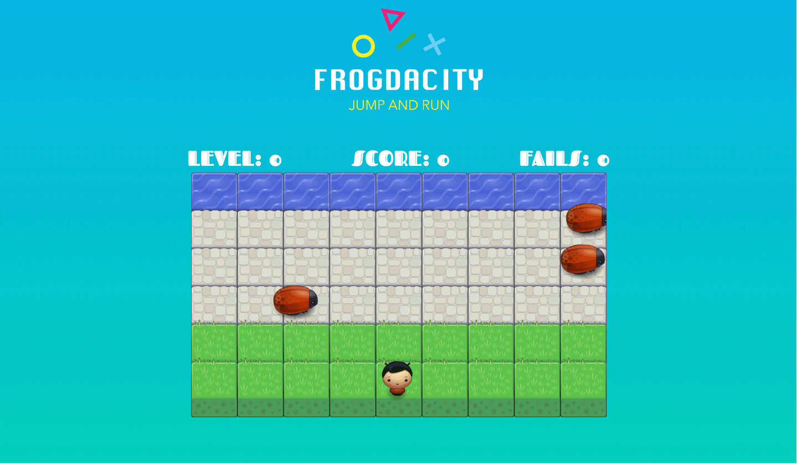

# 🐸 Frogdacity 🐸
**Try it out:** [Can you reach the water safely? Try it now!](https://lohluc.github.io/frogdacity-game)

Frogdacity is a classic arcade game built with object-oriented JavaScript. I created it during my [Udacity Front-End Web Development Nanodegree](https://de.udacity.com/course/front-end-web-developer-nanodegree--nd001/). It's a simple version of [Frogger](https://en.wikipedia.org/wiki/Frogger).



## Getting Started

### Installing

```
Example
```
```
Example
```

## How to play the game

The game uses keyboard input to move the player around the board.

- Use the arrow keys to move: ⬆️ ⬇️ ⬅️ ➡️
- Reaching the water increases your score by one 🔝
- You reach a new level every five score points. But be careful, the enemies are moving faster 🐞💨
- The game is over when your character hits an enemy! ⛔️


## License
This project is licensed under the MIT License - see the [LICENSE.md](LICENSE.md) file for details.

### Follow up

If you enjoy reading my code, please consider to take a look on [Twitter](https://twitter.com/luclohr) 🙂
